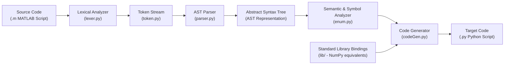

# On-Device Translation of Dynamically Typed Interpreted Languages ⚙️

[](https://ieeexplore.ieee.org/)
[](https://www.python.org/)
[](https://numpy.org/)
[](LICENSE)
[](.github/PULL_REQUEST_TEMPLATE.md)

> **Published in the 15th International Conference on Computing, Communication and Networking Technologies (ICCCNT) at IIT Mandi**  
> *A deterministic, on-device compiler and AST transpiler enabling high-speed semantic translation from MATLAB scientific routines into idiomatic, vectorized Python (NumPy) without cloud dependencies or neural hallucinations.*

---

## 📌 Abstract & Motivation

Scientific and engineering workflows often struggle with the divergence between proprietary numerical environments (MATLAB) and open-source scientific ecosystems (Python / NumPy). While recent Large Language Models (LLMs) can attempt code translation, they suffer from high inference latency, hardware resource requirements (GPU/VRAM), non-deterministic syntax bugs, and potential proprietary IP leakage.

This research presents an **on-device, rule-directed AST compilation engine** designed for resource-constrained edge systems. By constructing intermediate Abstract Syntax Trees (ASTs) and mapping numerical array primitives deterministically, the transpiler guarantees:
- **Zero Hallucination:** Deterministic semantic mapping preserves numerical correctness.
- **On-Device Efficiency:** Executes in sub-milliseconds on consumer CPUs with negligible RAM footprint.
- **Idiomatic Vectorization:** Translates MATLAB matrix operations and colon slices (`1:5`) directly into equivalent NumPy vector operations and standard library bindings.

---

## 🏗️ Compiler Architecture



---

## ✨ Features & Supported Constructs

1. **Control Flow Transpilation:**
   - Translates `for i = 1:N` into Python `for i in range(1, N + 1):`
   - Translates `while` conditions and multi-branch `if / elseif / else` constructs with strict block indentation.
2. **Matrix & Array Semantics:**
   - Translates 1-based indexing offsets to Python's 0-based slice conventions.
   - Vector concatenation: `[A, B]` $\rightarrow$ `np.hstack([A, B])`, `[A; B]` $\rightarrow$ `np.vstack([A, B])`.
3. **Built-in Mathematical Runtime Mappings (`lib/`):**
   - Direct standard library bridges for `zeros()`, `ones()`, `eye()`, `rand()`, `diag()`, `eig()`, `exp()`, `size()`, `arange()`, `log10()`, `mod()`, and `min()/max()`.
4. **Clean Code Generation:**
   - Emits clean, readable PEP 8 compliant Python source files.

---

## 📂 Project Structure

```text
├── Project/
│   ├── Code/
│   │   ├── Approach 1/
│   │   │   ├── lexer.py             # Lexer token scanner
│   │   │   ├── parser.py            # AST syntax parser
│   │   │   ├── codeGen.py           # Python code generator
│   │   │   ├── token.py             # Grammar token definitions
│   │   │   ├── Code Converter.py    # Main transpilation CLI
│   │   │   └── lib/                 # Standard math & matrix library adapters
│   │   └── Outputs/                 # Sample translated Python targets
│   ├── Paper Work/                  # Research paper manuscripts & presentation decks
│   └── Reference Papers/            # Foundational literature on compiler representations
├── .gitignore
├── LICENSE
├── README.md
└── requirements.txt
```

---

## 🚀 Quickstart

### 1. Requirements
- Python 3.8+
- NumPy

```bash
pip install -r requirements.txt
```

### 2. Running the Transpiler
To convert a sample MATLAB file into Python:

```bash
cd "Project/Code/Approach 1"

# Run the transpiler against a sample MATLAB script:
python "Code Converter.py"
```

The translated Python script will be generated with full standard library imports and executable syntax.

---

## 🧪 Example Transpilation

### Source: MATLAB (`Multiply.m`)
```matlab
A = [1, 2; 3, 4]
B = [5, 6; 7, 8]
C = A * B
disp(C)
```

### Output: Idiomatic Python (`Multiply.py`)
```python
import numpy as np

A = np.array([[1, 2], [3, 4]])
B = np.array([[5, 6], [7, 8]])
C = np.dot(A, B)
print(C)
```

---

## 🤝 Contributing & Pull Requests

We welcome contributions, especially extending grammar support for additional language constructs and functions.
Please see our [PR Template](.github/PULL_REQUEST_TEMPLATE.md) for contribution guidelines.

---

## 📜 Citation

If you reference this work, please cite our paper:
```bibtex
@inproceedings{pranav2024ondevice,
  title={On-Device Translation of Dynamically Typed Interpreted Languages},
  author={Pranav, H. and contributors},
  booktitle={Proceedings of the 15th International Conference on Computing, Communication and Networking Technologies (ICCCNT)},
  organization={IEEE / IIT Mandi},
  year={2024}
}
```

## 📄 License
This project is licensed under the [MIT License](LICENSE).
